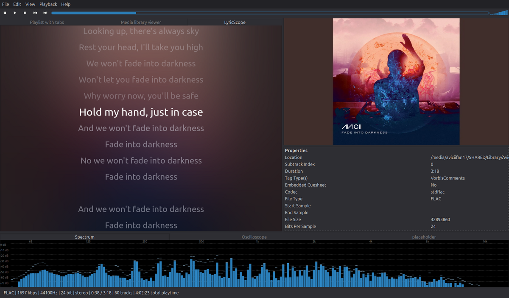

# LyricScope

A synced-lyrics panel for [DeaDBeeF](https://deadbeef.sourceforge.io/), on
Linux. It is a native GTK3 plugin, not a separate program: it appears as a
single tab docked inside the player's own window, alongside the playlist.
Lyrics come from `.lrc` sidecars, lyrics embedded in a track's tags, or a
central lyrics folder; the current line is highlighted and scrolls with
playback, and clicking any line seeks to it. The plugin is C, but it embeds
CPython to reuse a small tested Python backend (`linux/core/`) for finding
and parsing lyrics — that half already existed and there was nothing to
gain by retyping it in C.



---

## Requirements

Built and tested against **DeaDBeeF 1.10.2** (plugin API **1.5**, GTK3 UI
plugin API 2.6) on **Linux Mint 22 / Ubuntu 24.04**, Python 3.12, GTK 3.24.

> **If the plugin does not appear in DeaDBeeF after installing, check the
> DeaDBeeF version first.** Plugin ABI compatibility is not guaranteed
> across major DeaDBeeF version jumps. A plugin built against 1.10 headers
> may simply be ignored by a future 2.x without any error message beyond a
> line in the log. Rebuilding against that version's `deadbeef-plugins-dev`
> is the first thing to try; if the API changed, `plugin.api_vminor` in
> `plugin/src/plugin.c` and any changed struct layouts are where to look.

### Install the build dependencies

```bash
sudo apt install build-essential pkg-config libgtk-3-dev python3-dev \
                 deadbeef-plugins-dev python3-mutagen
```

What each is for:

| Package | Why |
|---|---|
| `build-essential`, `pkg-config` | compiler and the `pkg-config` used by the Makefile |
| `libgtk-3-dev` | GTK3, GDK, Cairo, Pango and gdk-pixbuf headers |
| `python3-dev` | `Python.h` and `libpython3.x.so`, for the embedded interpreter |
| `deadbeef-plugins-dev` | `deadbeef/deadbeef.h` and `deadbeef/gtkui_api.h` |
| `python3-mutagen` | reads lyrics out of a track's own tags at runtime |

`deadbeef-plugins-dev` comes from the same source as DeaDBeeF itself. On
Mint/Ubuntu that is usually the upstream PPA:

```bash
sudo add-apt-repository ppa:starws-box/deadbeef-player
sudo apt update
```

**`python3-mutagen` must be the system package, not a pip install into a
virtualenv.** The plugin runs the *system* interpreter and reads the system
`site-packages`; a venv is invisible to it unless you also set
`lyricscope.python_home` (see [Config keys](#config-keys)).

## Build and install

```bash
git clone https://github.com/CH0gun69/lyricscope.git
cd lyricscope/plugin
make
make install
```

That installs two things:

- `~/.local/lib/deadbeef/ddb_lyricscope_gtk3.so` — the plugin
- `~/.local/share/lyricscope/core/` — the Python backend

Then **restart DeaDBeeF**. Plugins are only loaded at startup.

Neither path is compiled in: the plugin looks up the backend at runtime
under `$XDG_DATA_HOME` (or `~/.local/share`), so the clone can live
anywhere and can be moved or deleted afterwards. Override with `PREFIX=`
and `DATADIR=` if you want them elsewhere.

`make uninstall` removes both. `make clean` removes build output.

## Adding the panel to the window

**The plugin does not place itself.** It registers a widget *type* called
`lyricscope`; DeaDBeeF's layout decides where widgets go, and a fresh
profile has no idea this one exists. After restarting:

1. **View → Design mode** (tick it).
2. Right-click the area you want to replace, or an empty tab bar.
3. **Replace with… → LyricScope**, or **Insert → LyricScope** to add it as
   a new tab in an existing tab container.
4. **View → Design mode** again to turn it off.

Design mode must be off for normal use — while it is on, right-clicking the
panel gives you DeaDBeeF's layout menu instead of LyricScope's settings.

If you prefer to edit `~/.config/deadbeef/config` by hand, the layout lives
in `gtkui.layout.1.9.0` as one line of JSON. A LyricScope panel is
`{"type":"lyricscope"}`. Adding it to a tab container also means bumping
that container's `num_tabs` and adding a matching `tabNNN` label — the tab
names are positional, so inserting a child without renumbering puts every
label on the wrong panel. **Quit DeaDBeeF before editing the file**, or it
will overwrite your changes when it exits.

## Using it

- **Click any line** to seek to it.
- **Right-click → Settings…** for text size, colour, blur, animation speed
  and alignment. Changes apply live; OK saves, Cancel reverts.

Lyrics are searched for in three places, and a *synced* result always beats
an unsynced one, so a stale plain-text lyrics tag can't mask a timestamped
`.lrc` next to the track:

1. a sidecar beside the audio file — `<track>.lrc`, then `<track>.txt`
2. lyrics embedded in the track's tags
3. a central folder keyed by `"<artist> - <title>"`, default
   `~/.config/deadbeef/lyrics` — this is how foobar2000's `foo_openlyrics`
   stores a library, so an imported collection lands here

## Config keys

Stored in DeaDBeeF's own config (`~/.config/deadbeef/config`). Everything
except `python_home` is set through the settings dialog; edit by hand only
with DeaDBeeF closed.

| Key | Default | Controls |
|---|---|---|
| `lyricscope.text_px` | `26` | Line size at full scale, in **device pixels** (not points — see traps). Range 10–72. |
| `lyricscope.accent` | `#8ab4ff` | Colour of the current line, `#rrggbb`. Past/future lines are deliberately *not* derived from this. |
| `lyricscope.blur_radius` | `36` | Backdrop blur strength, at build size. `0` leaves the cover art sharp. Range 0–96. |
| `lyricscope.transition_ms` | `190` | How long a line takes to grow/shrink when it becomes current. Easing is always OutCubic. Range 0–1200. |
| `lyricscope.alignment` | `1` | `0` left, `1` centre, `2` right. |
| `lyricscope.python_home` | *(unset)* | Directory containing `core/`. Unset means `$XDG_DATA_HOME/lyricscope`. Point it at `<clone>/linux` to run from a checkout without `make install`. |

Unset keys fall back to the compiled-in defaults in
`plugin/src/animations.h` and `plugin/src/theme.h`, so those two headers
remain the answer to "what does this look like out of the box".

## Known traps

Everything here cost real debugging time and none of it is guessable from
the headers. If something breaks, start here.

**The artwork plugin's id is `artwork2`, not `artwork`.** The file is
`artwork.so` but the plugin inside registers under the v2 id.
`plug_get_for_id("artwork")` returns NULL, and the only symptom is a flat
backdrop with no cover art and no error.

**`gtk/gtk.h` must be included before `deadbeef/gtkui_api.h`.** That header
falls back to `typedef void GtkWidget` when GTK's headers have not been
seen yet. It then collides with the real declaration and buries the build
in type errors that point everywhere except the include order.

**libpython must be `dlopen`ed with `RTLD_GLOBAL` before initialising the
interpreter.** DeaDBeeF opens plugins into a *local* symbol scope, and a
library pulled in via `DT_NEEDED` inherits that scope. Python's own C
extension modules do not link against libpython — they expect its symbols
to be globally visible in the process — so without this, importing any of
them fails with an undefined symbol while libpython is plainly loaded.
Related: the soname is built from `PY_MAJOR_VERSION`/`PY_MINOR_VERSION` at
compile time rather than hardcoded, because `libpython3.12.so.1.0` is only
correct on a machine running 3.12.

**`w_override_signals` takes over whatever widget you hand it.** Give it
the drawing area directly and Design Mode's button handling replaces the
panel's own, so clicking silently stops working — no error, no warning.
The panel is therefore a `GtkEventBox` with the drawing area inside: gtkui
gets the container, the content keeps its own handlers. Lyricbar has the
same shape for the same reason.

**Right-click must check `w_get_design_mode()` and back off.** While Design
Mode is on, that right-click menu is how a widget gets moved, replaced or
deleted. Taking it over with a settings menu strands the panel in the
layout with no way to remove it.

**The player's process is called `deadbeef-main`, not `deadbeef`.** It
renames its main thread, so that is what `/proc/<pid>/comm` holds and
`pgrep -x deadbeef` matches nothing while the player is plainly running.
Also relevant if you ever script around the CLI: **every `deadbeef`
invocation is itself a `deadbeef-main`** for ~600ms while it forwards over
the IPC socket and exits, and **`deadbeef --nowplaying-tf` starts the
player if none is running** rather than failing.

**Font size is in pixels, not points, and animation never touches it.** The
line size is set with `pango_font_description_set_absolute_size` so it
lands on a device pixel without the font engine rounding it. Growing a line
is a *Cairo transform*, never a font-size change: font sizes quantise to
whole pixels, so animating 0.80→1.00 of a 26px line yields only six
distinct sizes — a visible step every other frame. Hinted *metrics*
quantise the same way one layer down, which is why the panel sets
`CAIRO_HINT_METRICS_OFF`.

## Repository layout

```
plugin/                 the DeaDBeeF plugin (C)
  Makefile
  src/
    plugin.c            registration, w_reg_widget
    panel.c             the drawing area: layout, animation, click-to-seek
    artwork.c           cover lookup, blur, cross-fade
    pybridge.c          the only place this talks to Python
    settings.c          the lyricscope.* config keys
    config_dialog.c     the right-click settings dialog
    animations.h        every duration, easing and size (defaults)
    theme.h             every colour (defaults)
linux/                  the Python backend the plugin embeds
  core/lrc.py           LRC parsing, position -> line matching
  core/resolver.py      the three lyrics sources
  tests/                18 tests, no DeaDBeeF required
archive/pyside6-app/    a retired standalone version, kept for reference
```

### Running the backend tests

```bash
sudo apt install python3-pytest      # or use a virtualenv
cd linux && python3 -m pytest tests/ -q
```

These test the lyrics resolution and LRC parsing only — no DeaDBeeF, no
GTK, no display needed.

### The archived PySide6 app

`archive/pyside6-app/` is an earlier version that ran as its own window
next to DeaDBeeF and talked to it over the CLI and MPRIS. It is tracked
because its README documents IPC and D-Bus findings that the in-process
plugin no longer needs but that would be annoying to rediscover. It is not
built or installed by anything here, and it needs PySide6 (see its own
`requirements.txt`) if you actually want to run it.

## Licence

MIT.
